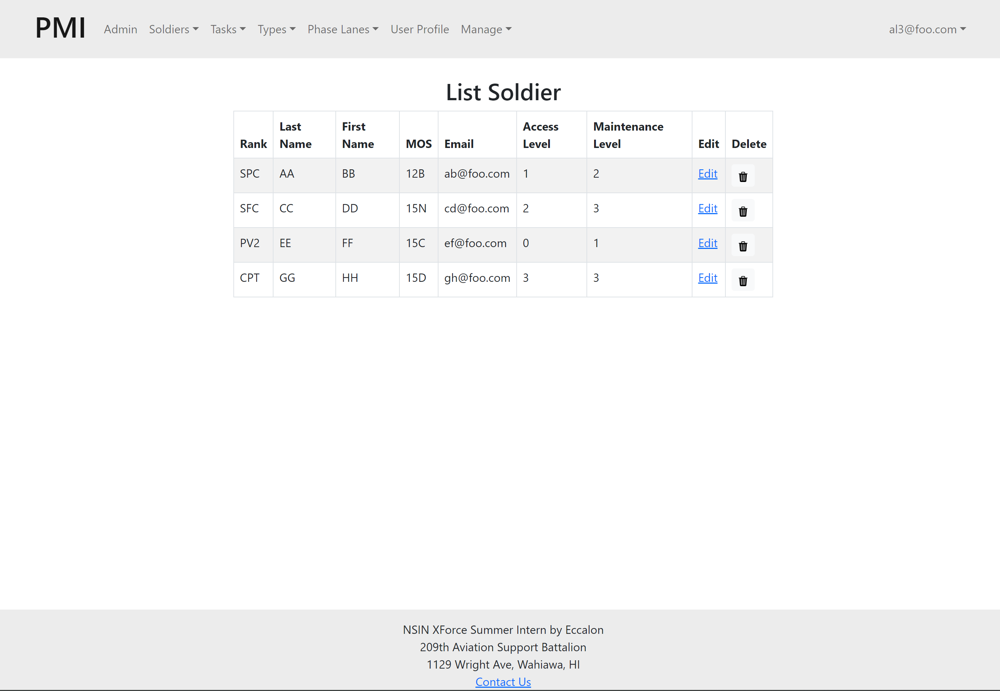
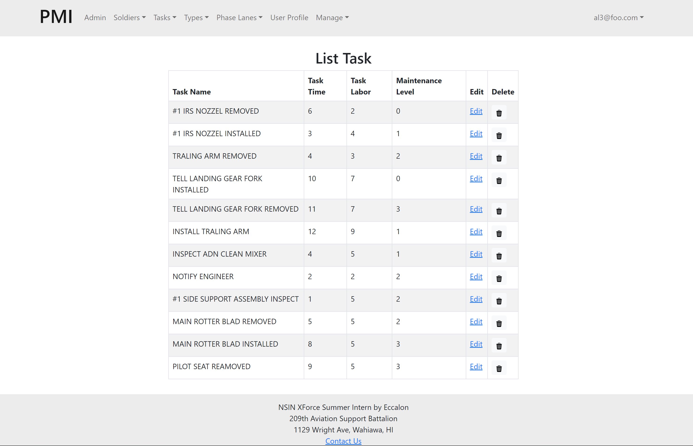

## Table of contents
* [Overview](#overview)
* [User Guide](#user-guide)
* [Developer Guide](#developer-guide)
* [Development History](#project-development-history)
* [Developers](#developers)

## Overview

PMI-XFORCE-2023 is an Aircraft Phase Maintenance Project Management system that allows the organization to schedule, monitor, adjust, and analyze multiple maintenance phases over the year. 

The application is built using:
- [React](https://react.dev/) and [JavaScript](https://www.javascript.com/) for component-based UI implementation and routing.
- [MongoDB](https://www.mongodb.com/) for database

## User Guide
This section provides a walkthrough of our interface and its current capabilities. The screenshots show the current state of the project. 

### Landing Page


### SignUp Page


### SignIn Page


### Admin User Pages


### General User Pages (with access level 0)


### AL1 User Pages


### AL2 User Pages


### AL3 User Pages


### Listing Pages (Only for Admin and AL3)





### Yearly View


### Monthly View


### Weekly View


## Developer Guide
1. Download a copy of PMI-XFORCE-2023. You can download either using Github Desktop (recommended
) or by extracting the .zip. As the repo is currently private, please contact one of the
 developers to get the download.

2. Make sure you have Node.js and <a href="https://docs.meteor.com/install.html"> Meteor </a> installed on your local computer. If not, please install it before you start this project.

3. Another important note, make sure your Node.js version is between 10-14. Downgrade your version if it is too high. Otherwise, you will not able to run this project succesfully.

4. Once you have all the software installed, you can open the project in an code editor.

5. Then open a terminal, nevigate to where the project is.

6. Type ``cd app`` to change directory into the application.

7. Run ``meteor npm install`` to install the dependencies.

8. Then run ``meteor npm run start`` to build the application and view it.

9. Once it is successfully build, you can go to your browser, and type in ``http://localhost:3000/``to view the application.

10. To stop the project, simply press``control-C`` twice in the terminal.

11. First time running it might take a while to build it.

12. You can run the project in local or on the private server.

### Database Model
Will update soon

## Project Development History

To track our progress here based on the issues we completed weekly:
- [Week 3](https://github.com/orgs/PMI-XFORCE-2023/projects/10/views/1)
- [Week 4](https://github.com/orgs/PMI-XFORCE-2023/projects/11/views/1)
- [Week 5](https://github.com/orgs/PMI-XFORCE-2023/projects/13/views/1)
- [Week 6](https://github.com/orgs/PMI-XFORCE-2023/projects/14/views/1)
- [Week 7](https://github.com/orgs/PMI-XFORCE-2023/projects/16/views/1)
- [Week 8](https://github.com/orgs/PMI-XFORCE-2023/projects/17/views/1)
- [Week 9](https://github.com/orgs/PMI-XFORCE-2023/projects/18/views/1)
- [Week 10](https://github.com/orgs/PMI-XFORCE-2023/projects/19/views/1)


### Week 3: 
The goal of Week 3:
- Creating the default template for one.
- Then the following days creating at least the ui for the login page.
- By the end of this week at least find a module to use to build a calendar.

**To see which issues have been finished during Week 3, please click: [Week 3](https://github.com/orgs/PMI-XFORCE-2023/projects/10/views/1)**

_Note:_ To access our repo, please contact one of the developers as it is currently private.

### Week 4: 
The goal of Week 4:
- calendar views
- landing page and admin pages
- general user pages
- Tools to wrap the webapp into desktop app (research)
- add github.io page for documentations

**To see which issues have been finished during Week 4, please click: [Week 4](https://github.com/orgs/PMI-XFORCE-2023/projects/11/views/1)**

### Week 5:
The goal of week 5:
- Weekly View completed
- Popup module for weekly view draft completed
- Tests updated
- Monthly view and event display completed

**To see which issues have been finished during Week 5, please click [Week 5](https://github.com/orgs/PMI-XFORCE-2023/projects/13/views/1)**

### Week 6:
The goal of week 6:
- add way to edit phase lane events for the yearly and monthly views
- create more tables (data)
- establish the relation between each table
- access control implementation

**To see which issues have been finished during Week 6, please click [Week 6](https://github.com/orgs/PMI-XFORCE-2023/projects/14/views/1)**

### Week 7:
The goal of week 7:
- keep working on the calendar views
- base visit to touch basis on what is good and what need to fix

**To see which issues have been finished during Week 7, please click [Week 7](https://github.com/orgs/PMI-XFORCE-2023/projects/16/views/1)**

### Week 8:
The goal of week 8:
- Fix the calendar views to mimic the excel sheet that sponsor send
- Create user Dashboard
- try to get the access control done
- Make the documentation about how to set up and run this application with more details.

**To see which issues have been finished during Week 8, please click [Week 8](https://github.com/orgs/PMI-XFORCE-2023/projects/17/views/1)**

### Week 9:
The goal of week 9:
- Complete testing
- To add drag and drop functionality to week view
- Finish the presentation for next week (Send the recording by Friday)
- Finish the access control, user dashboard
- Make sure the daily/weekly/monthly/yearly views all meet the sponsors' needs
- Make sure the GitHub.io page is up to date with everything we have developed so far.

**To see which issues have been finished during Week 9, please click [Week 9](https://github.com/orgs/PMI-XFORCE-2023/projects/18/views/1)**

### Week 10:
The goal of Week 10:
- Complete all the exsiting tasks
- Finish any needed testing for the application
- Finish documenting all the pages of the application
- Clean up work for anything as needed

**To see which issues have been finished during Week 10, please click [Week 10](https://github.com/orgs/PMI-XFORCE-2023/projects/19/views/1)**

## Deploy the App
As the physical server has not been purchased yet, we will deploy the app to the Digital Ocean which is a cloud web service platform to
simulate the process of deployment. It should provides the similar experience.
### 1. Sign up with <a href = "https://www.digitalocean.com/?refcode=131fa52c7ddd&utm_campaign=Referral_Invite&utm_medium=Referral_Program&utm_source=CopyPaste"> Digital Ocean </a>.
### 2. Create an Ubuntu server (i.e. "droplet") as the virtual machine. 
Then find the Create Droplets page, select the Basic Plan and the most basic CPU:

Scroll down and create a root password for your server. (Don't use SSH keys).
Click "Create Droplet" at the bottom. You will go to a page that shows your newly created droplet:
   

### Local setup
The remainder of this deployment will be done on your laptop.

### 3. Clone a copy of the <a href = "https://github.com/PMI-XFORCE-2023/PMI-XFORCE-2023"> repo </a> to your personal GitHub account and then to your laptop.
Next run ````meteor npm install```` and ````meteor npm run start```` to verify that application runs correctly in you local environment. 
(you need to <a href="https://docs.meteor.com/install.html"> install Meteor </a> first).
### 4. Install Meteor Up. 
Following the directions to <a href="https://meteor-up.com/getting-started.html#install">install Meteor Up</a>, install Meteor Up onto your laptop by running:
``$ npm install --global mup``.
### 5. Create app/.deploy/mup.js and app/.deploy/settings.json. 
Create a Project in any editor for your local copy so you can edit files.
   In the app/.deploy directory, you’ll find two files: mup.sample.js and settings.sample.json. Make a copy of mup.sample.js called mup.js, and a copy of settings.sample.json called settings.json. When you’re done, the .deploy directory should look like this:

- The files mup.js and settings.json are git-ignored, so you can store credentials in these files without fear of them being accidentially uploaded to GitHub.
### 6. Initial deployment
To do the initial deployment, you only need to edit mup.js. It starts out looking like this:
```module.exports = {
    servers: {
        one: {
        host: '111.222.333.444',
        username: 'root',
        password: 'changeme'
        }
    },

    app: {
        name: 'meteor-application-template-react',
        path: '../',

        servers: {
        one: {},
    },

    buildOptions: {
        serverOnly: true,
    },

    env: {
        ROOT_URL: 'http://111.222.333.444',
        MONGO_URL: 'mongodb://mongodb/meteor',
        MONGO_OPLOG_URL: 'mongodb://mongodb/local',
    },

    docker: {
        image: 'zodern/meteor:latest',
    },

    enableUploadProgressBar: true
    },

    mongo: {
        version: '5.0.5',
        servers: {
            one: {}
        }
    },
  };
  ```

There is one occurrence of the string “changeme”, and two occurrences of the string “111.222.333.444”.

Change the string “changeme” (i.e. the server root password) to the Droplet root password you specified above.

Change the string “111.222.333.444” to the IP address associated with this Droplet. (In the screenshots above, the Droplet’s IP address is 147.182.192.144.) Be sure to use the “ipv4” address, not the “Private IP” address!

Note that the “host” value is just the IP address, but the ROOT_URL is “http://” followed by the IP address.

### 7. Run mup setup. 
The next stop is to setup your Droplet to run your Meteor application and MongoDB database. Inside the app/.deploy directory,
 invoke ``mup setup`` You should get output like the following:
```
PS D:\Github\pmi\app\.deploy> mup stop

Started TaskList: Stop Meteor
[147.182.192.144] - Stop Meteor
[147.182.192.144] - Stop Meteor: SUCCESS
PS D:\Github\pmi\app\.deploy> mup setup

Started TaskList: Setup Docker
[147.182.192.144] - Setup Docker
[147.182.192.144] - Setup Docker: SUCCESS

Started TaskList: Setup Meteor
[147.182.192.144] - Setup Environment
[147.182.192.144] - Setup Environment: SUCCESS

Started TaskList: Setup Mongo
[147.182.192.144] - Setup Environment
[147.182.192.144] - Setup Environment: SUCCESS
[147.182.192.144] - Copying Mongo Config
[147.182.192.144] - Copying Mongo Config: SUCCESS

Started TaskList: Start Mongo
[147.182.192.144] - Start Mongo
[147.182.192.144] - Start Mongo: SUCCESS

Started TaskList: Setup proxy
[147.182.192.144] - Setup Environment
[147.182.192.144] - Setup Environment: SUCCESS
[147.182.192.144] - Pushing the Startup Script
[147.182.192.144] - Pushing the Startup Script: SUCCESS
[147.182.192.144] - Pushing Nginx Config Template
[147.182.192.144] - Pushing Nginx Config Template: SUCCESS
[147.182.192.144] - Pushing Nginx Config
[147.182.192.144] - Pushing Nginx Config: SUCCESS
[147.182.192.144] - Cleaning Up SSL Certificates
[147.182.192.144] - Cleaning Up SSL Certificates: SUCCESS
[147.182.192.144] - Configure Nginx Upstream
[147.182.192.144] - Configure Nginx Upstream: SUCCESS

Started TaskList: Start proxy
[147.182.192.144] - Start proxy
[147.182.192.144] - Start proxy: SUCCESS

Next, you should run:
mup deploy
```
For more details on the setup command, see http://meteor-up.com/docs.html#setting-up-a-server.
### 8. Run mup deploy. 
Now you can bundle up your Meteor application, send it over to the Droplet, and start it running on your Droplet.
Inside the app/.deploy directory, invoke ``mup deploy``. You should get output like the following:
```
PS D:\Github\pmi\app\.deploy> mup deploy
Cleaning Up Previous Builds
Building App Bundle Locally                                                                           
                                                                            
Started TaskList: Pushing Meteor App
[147.182.192.144] - Pushing Meteor App Bundle to the Server
[147.182.192.144] - Pushing Meteor App Bundle to the Server: SUCCESS

Started TaskList: Prepare App Bundle
[147.182.192.144] - Prepare Bundle
[147.182.192.144] - Prepare Bundle: SUCCESS

Started TaskList: Configuring App
[147.182.192.144] - Pushing the Startup Script
[147.182.192.144] - Pushing the Startup Script: SUCCESS
[147.182.192.144] - Sending Environment Variables
[147.182.192.144] - Sending Environment Variables: SUCCESS

Started TaskList: Start Meteor
[147.182.192.144] - Start Meteor
[147.182.192.144] - Start Meteor: SUCCESS
[147.182.192.144] - Verifying Deployment
[147.182.192.144] - Verifying Deployment: SUCCESS

```
For more details on the deploy command, see http://meteor-up.com/docs.html#deploying-an-app.

### 9. View your deployed application. 
The meteor-application-template-react application will now be available at http://111.222.333.444, where “111.222.333.444” is replaced by the IP address for your Droplet.
For example:


### Caution: avoid two simultaneous deployments!
It is unfortunately easy to deploy your app twice if you change the “name” field in mup.js. Let’s say your mup.js file looks like this:
```
:
app: {
name: 'pmi',
:
```
And then you run mup deploy to deploy your application. Now you decide to change the name of your application to, say, ‘grub-n-go’:
```
:
app: {
name: 'something-else',
:
```
And you run ``mup deploy`` again. Unfortunately, this will result in two versions of your application running at the same time, one called “meteor-application-template-react” and one called “grub-n-go”.
Having two deployments running simultaneously will create really strange, difficult to understand behavior when you visit the site, because sometimes the first version of your application will serve the page, and sometimes the second version will serve the page.

To avoid this situation entirely, make sure that if you change the name of your application in mup.js, you run ``mup stop`` first. That way, mup will terminate the process running under the original name, so that when you run ``mup deploy`` after editing mup.js, there will only be one deployed application.

If you are in the situation where there are two deployments running simultaneously, it’s easy to fix. First, edit mup.js to restore the original name, then run ``mup stop`` to stop that process. Finally, edit mup.js back to the new name and run ``mup deploy`` again, then run ``mup logs`` to ensure that everything is OK.

## Developers
Here are the people who worked on this project:

Hangbo Zhang: Find his Github <a href = "https://github.com/hangbozhang">here.</a> 

Trevor Kansaki: Find his Github <a href = "https://github.com/tkansaki">here.</a> 

Pauline Peihan Wu: Find her Github <a href = "https://github.com/Pauline-Peihan-Wu">here.</a> 

Thane Luna: Find his Github <a href = "https://github.com/Thaneluna">here.</a> 


